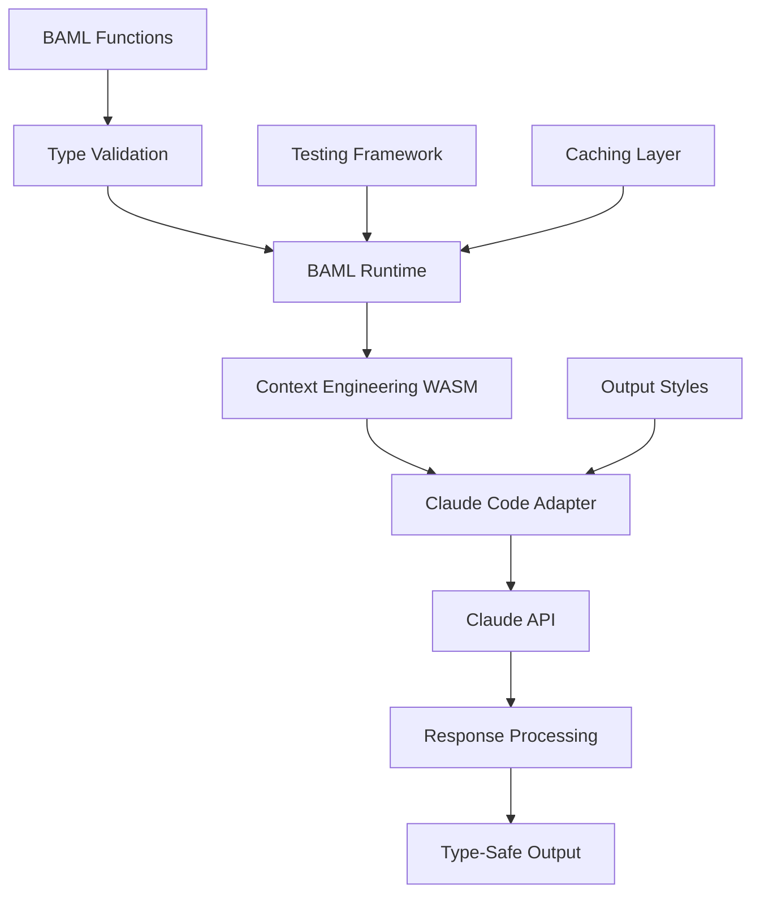

# BAML Claude Code Integration Guide

## Overview

This guide explains how to leverage BAML (Boundary API Modeling Language) within Claude Code to create a unified, type-safe, and testable prompt engineering experience. The integration combines:

1. **BAML Functions** - Type-safe prompt templates
2. **Context Engineering** - Your existing Rust/WASM runtime
3. **Claude Code** - Execution environment with custom output styles
4. **Testing Framework** - Prompt optimization and A/B testing

## Quick Start

### 1. Initialize the BAML Runtime

```typescript
import { BAMLRuntime } from './baml/runtime/baml-runtime';
import { ClaudeCodeAdapter } from './baml/adapters/claude-adapter';

const runtime = new BAMLRuntime({
  adapter: new ClaudeCodeAdapter({
    apiKey: process.env.CLAUDE_API_KEY,
    model: 'claude-3-opus'
  }),
  promptsDir: './baml/prompts',
  outputStyle: 'unified-engineering',
  cacheEnabled: true,
  parallelExecution: true
});
```

### 2. Execute BAML Functions

```typescript
// Simple execution
const result = await runtime.execute('analyzeCodeAdvanced', {
  code: sourceCode,
  context: {
    language: 'typescript',
    framework: ['react', 'tanstack-router'],
    patterns: ['hooks', 'context-api'],
    constraints: ['performance', 'type-safety']
  },
  focus: ['performance', 'security']
});

// Access typed results
console.log(result.data.summary);
console.log(result.data.issues);
console.log(result.metrics);
```

### 3. Use Workflows for Complex Tasks

```typescript
// Multi-step workflow
const workflow = await runtime.executeWorkflow([
  {
    functionName: 'analyzeCodeAdvanced',
    params: () => ({ code, context, focus: ['all'] })
  },
  {
    functionName: 'generateTestSuite',
    params: (analysis) => ({
      code,
      requirements: analysis.suggestions.map(s => s.description),
      testFramework: 'jest'
    })
  },
  {
    functionName: 'optimizePerformance',
    params: (tests) => ({
      code,
      metrics: currentMetrics,
      targets: performanceTargets
    })
  }
]);
```

### 4. Test and Optimize Prompts

```typescript
import { PromptTestingFramework } from './baml/test/prompt-testing-framework';

const tester = new PromptTestingFramework(runtime);

// Register test cases
tester.registerTestCase({
  name: 'code-analysis-accuracy',
  description: 'Test code analysis accuracy',
  input: {
    code: testCode,
    context: testContext,
    focus: ['security']
  },
  validators: [
    {
      name: 'finds-sql-injection',
      check: (output) => ({
        passed: output.issues.some(i => i.type === 'sql-injection'),
        score: output.issues.filter(i => i.type === 'sql-injection').length / expectedIssues
      }),
      required: true
    }
  ]
});

// Run tests with variations
const results = await tester.runTestCase(
  'code-analysis-accuracy',
  'analyzeCodeAdvanced'
);

// Optimize prompts using evolutionary algorithm
const optimized = await tester.optimizePrompt(
  'code-analysis-accuracy',
  'analyzeCodeAdvanced',
  5, // generations
  10  // population size
);
```

## Architecture Details

### Component Interaction



### File Structure

```
/core/packages/ai/src/baml/
├── prompts/                      # BAML function definitions
│   ├── software_engineering.baml # Engineering-focused functions
│   ├── data_analysis.baml       # Data science functions
│   └── creative_writing.baml    # Creative content functions
├── runtime/
│   ├── baml-runtime.ts          # Core runtime implementation
│   ├── claude-adapter.ts        # Claude Code integration
│   └── cache-manager.ts         # Intelligent caching
├── styles/                      # Output style configurations
│   ├── unified-engineering.json # Engineering-optimized style
│   ├── research-focused.json    # Research & analysis style
│   └── rapid-prototype.json     # Quick iteration style
├── test/
│   ├── prompt-testing-framework.ts # Testing & optimization
│   └── validators/              # Reusable validators
└── schemas/                     # TypeScript type definitions
    └── types.ts
```

## BAML Function Development

### Creating New Functions

1. **Define the BAML function**:

```baml
// prompts/my_functions.baml

class InputType {
  field1: string
  field2: int
  field3: string[]
}

class OutputType {
  result: string
  confidence: float
  metadata: Metadata
}

function myCustomFunction(
  input: InputType,
  options: string[] = ["default"]
) -> OutputType {
  prompt #"
    Given the input: {{ input }}
    With options: {{ options }}
    
    Perform the following analysis:
    1. [Specific instruction]
    2. [Another instruction]
    
    Return a structured response with:
    - A clear result
    - Confidence score (0-1)
    - Relevant metadata
  "#
}
```

2. **Register with the runtime**:

```typescript
runtime.registerFunction({
  name: 'myCustomFunction',
  bamlPath: './prompts/my_functions.baml'
});
```

3. **Execute with type safety**:

```typescript
const result = await runtime.execute<OutputType>('myCustomFunction', {
  input: {
    field1: 'value',
    field2: 42,
    field3: ['a', 'b', 'c']
  },
  options: ['advanced', 'detailed']
});
```

### Best Practices

#### 1. Function Design
- Keep functions focused on a single responsibility
- Use clear, descriptive names
- Define comprehensive input/output types
- Include validation logic in the prompt

#### 2. Prompt Engineering
- Start with clear instructions
- Use structured output formats
- Include examples when helpful
- Add constraints and guardrails

#### 3. Type Safety
- Define all types in BAML
- Use TypeScript interfaces for runtime
- Validate inputs and outputs
- Handle edge cases explicitly

#### 4. Performance
- Enable caching for deterministic functions
- Use parallel execution for independent tasks
- Optimize token usage with concise prompts
- Monitor and track performance metrics

## Advanced Features

### Recursive Self-Improvement

```typescript
const improved = await runtime.executeRecursive(
  'refactorCode',
  { code: messyCode, goals: ['clarity', 'performance'] },
  5, // iterations
  (result) => evaluateCodeQuality(result.refactoredCode)
);
```

### Parallel Multi-Function Execution

```typescript
const [analysis, tests, docs] = await runtime.executeParallel([
  {
    functionName: 'analyzeCodeAdvanced',
    params: { code, context, focus: ['all'] }
  },
  {
    functionName: 'generateTestSuite',
    params: { code, requirements, testFramework: 'jest' }
  },
  {
    functionName: 'generateDocumentation',
    params: { code, style: 'comprehensive' }
  }
]);
```

### A/B Testing Variations

```typescript
const abResults = await tester.abTest(
  'test-case-name',
  'functionName',
  { id: 'v1', name: 'Concise', modifiers: { maxTokens: 500 } },
  { id: 'v2', name: 'Detailed', modifiers: { maxTokens: 2000 } },
  100 // iterations
);

console.log(`Winner: ${abResults.winner} with ${abResults.confidence * 100}% confidence`);
```

### Custom Output Styles

```typescript
// Load custom style
runtime.setOutputStyle('rapid-prototype');

// Or define inline
runtime.setOutputStyle({
  response: {
    structure: { format: 'minimal' },
    tone: { style: 'direct', verbosity: 'minimal' }
  },
  workflow: {
    phases: ['implement', 'verify']
  }
});
```

## Integration with Context Engineering

Your existing Rust/WASM modules provide powerful runtime capabilities:

### Field Resonance Analysis

```typescript
const resonance = await runtime.execute('analyzeFieldResonance', {
  pattern: codePattern,
  field: contextField,
  method: 'embedding'
});
```

### Protocol Shell Execution

```typescript
const protocol = await runtime.execute('executeProtocol', {
  shell: 'co-emergence',
  input: { streams: [dataStream1, dataStream2] },
  operations: ['AttractorScan', 'FieldEvolution']
});
```

### Scoring and Evaluation

```typescript
const scores = await runtime.execute('evaluateOutput', {
  text: generatedContent,
  criteria: ['coherence', 'clarity', 'relevance'],
  weights: [0.4, 0.3, 0.3]
});
```

## Performance Optimization

### Caching Strategy

```typescript
// Cache by content hash
const result = await runtime.execute('analyzeCode', params, {
  cacheKey: hashContent(params.code)
});

// Cache with TTL
runtime.setCacheOptions({
  ttl: 3600, // 1 hour
  maxSize: 100 // max entries
});
```

### Token Optimization

```typescript
// Monitor token usage
runtime.on('execution', (event) => {
  console.log(`Tokens used: ${event.metrics.tokens}`);
  console.log(`Cost estimate: $${event.metrics.tokens * 0.00001}`);
});

// Set token limits
runtime.setTokenLimits({
  maxPerExecution: 4000,
  maxPerSession: 100000
});
```

### Parallel Execution

```typescript
// Configure parallelization
runtime.setParallelOptions({
  maxConcurrent: 4,
  queueSize: 20,
  priorityFunction: (task) => task.priority || 0
});
```

## Error Handling

```typescript
try {
  const result = await runtime.execute('functionName', params);
  
  if (!result.success) {
    // Handle execution failure
    console.error('Execution failed:', result.error);
    
    // Retry with fallback
    const fallback = await runtime.execute('simplifiedFunction', params);
  }
} catch (error) {
  // Handle runtime errors
  if (error.code === 'RATE_LIMIT') {
    await delay(error.retryAfter);
    // Retry
  } else if (error.code === 'INVALID_PARAMS') {
    // Fix parameters
  }
}
```

## Monitoring and Analytics

```typescript
// Track execution metrics
runtime.on('execution:complete', (metrics) => {
  analytics.track('baml_execution', {
    function: metrics.functionName,
    latency: metrics.latency,
    tokens: metrics.tokens,
    success: metrics.success,
    cacheHit: metrics.cacheHit
  });
});

// Export performance data
const performanceData = runtime.getPerformanceMetrics();
console.log('Average latency:', performanceData.avgLatency);
console.log('Success rate:', performanceData.successRate);
console.log('Cache hit rate:', performanceData.cacheHitRate);
```

## Deployment Considerations

### Environment Variables

```bash
# Required
CLAUDE_API_KEY=your_api_key
BAML_PROMPTS_DIR=/path/to/prompts
BAML_CACHE_ENABLED=true

# Optional
BAML_PARALLEL_EXECUTION=true
BAML_MAX_CONCURRENT=4
BAML_CACHE_TTL=3600
BAML_TEST_MODE=false
```

### Production Setup

```typescript
// Production configuration
const runtime = new BAMLRuntime({
  adapter: new ClaudeCodeAdapter({
    apiKey: process.env.CLAUDE_API_KEY,
    model: 'claude-3-opus',
    maxRetries: 3,
    timeout: 30000
  }),
  promptsDir: process.env.BAML_PROMPTS_DIR,
  outputStyle: 'production-optimized',
  cacheEnabled: true,
  parallelExecution: true,
  monitoring: {
    enabled: true,
    endpoint: process.env.MONITORING_ENDPOINT
  }
});
```

## Next Steps

1. **Explore the example BAML functions** in `/prompts/software_engineering.baml`
2. **Customize the output style** in `/styles/unified-engineering.json`
3. **Create test cases** for your specific use cases
4. **Run optimization** to find the best prompt variations
5. **Monitor performance** and iterate on improvements

## Support and Resources

- [BAML Documentation](https://docs.boundaryml.com)
- [Claude Code API Reference](https://docs.anthropic.com/claude/reference)
- [Context Engineering Specs](../../../COMPLETE_CONTEXT_ENGINEERING_RUST.md)
- [Project CLAUDE.md](../../../../../CLAUDE.md)

## Contributing

To contribute new BAML functions or improvements:

1. Create your function in `/prompts`
2. Add corresponding TypeScript types
3. Write comprehensive tests
4. Document usage examples
5. Submit a pull request

This integration provides a powerful, type-safe, and testable approach to prompt engineering within Claude Code, leveraging your existing context engineering infrastructure for optimal performance.